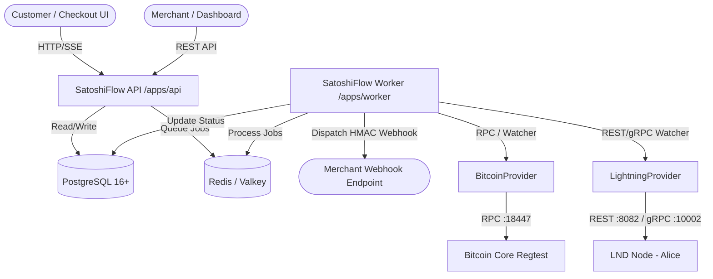
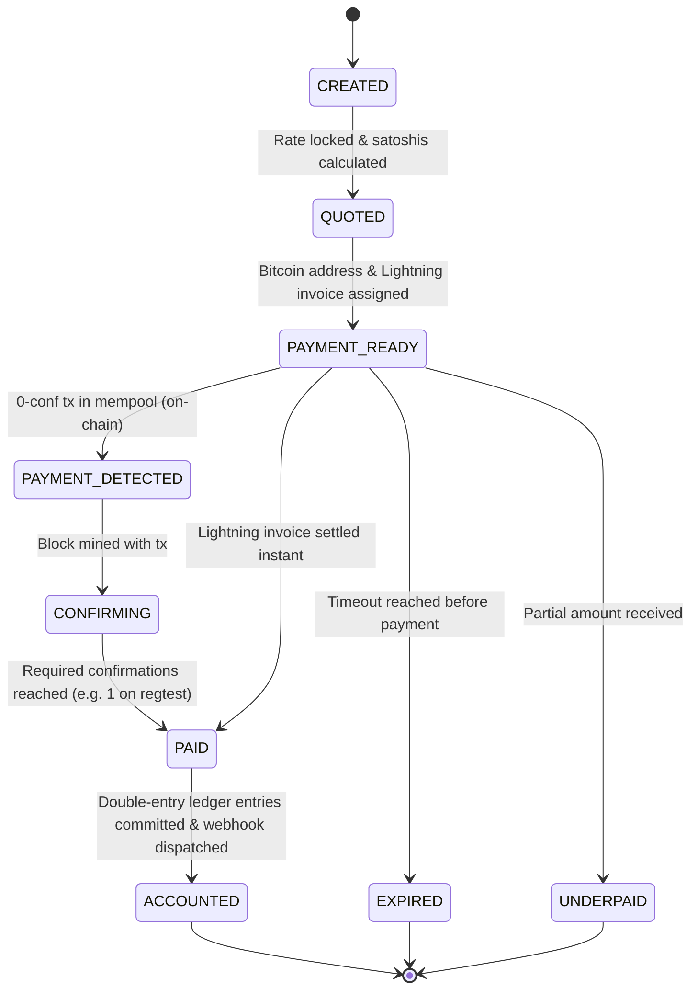

# SATOSHIFLOW ARCHITECTURE & RESEARCH SYNTHESIS

## 1. Executive Summary & Core Rules
SatoshiFlow is a non-custodial, high-reliability Bitcoin & Lightning payment platform.
Core invariants:
- **0.5% Customer-Pays-Fee Model**: Processing fee is 50 basis points added to product price:
  `customer_total = merchant_price / (1 - 0.005)`.
- **Double-Entry Accounting Ledger**: Merchant balances are strictly derived from immutable double-entry ledger entries (`ledger_accounts` & `ledger_entries`).
- **Exact Monetary Precision**: Bitcoin is stored in integer satoshis. Fiat currencies use exact decimal scale (cents/millisats). Floating point numbers are prohibited in financial paths.
- **Pure Self-Custody**: SatoshiFlow never stores or requests merchant private keys or seeds. On-chain addresses are generated via watch-only descriptors or xpubs.
- **Pluggable Blockchain Providers**: Zero direct coupling between core payment business logic and Bitcoin Core / LND RPCs.

## 2. Component Topology

## 3. Payment State Machine

## 4. Ledger Accounting Schema (Double-Entry)
Every settled payment generates 4 balanced journal entries:
1. `DEBIT Merchant_Settlement_Receivable (BTC)`: Customer payment received.
2. `CREDIT Merchant_Available_Balance (BTC)`: Merchant net funds (`customer_total - fee`).
3. `CREDIT SatoshiFlow_Fee_Revenue (BTC)`: Platform fee (0.5%).
Total Debits == Total Credits.
